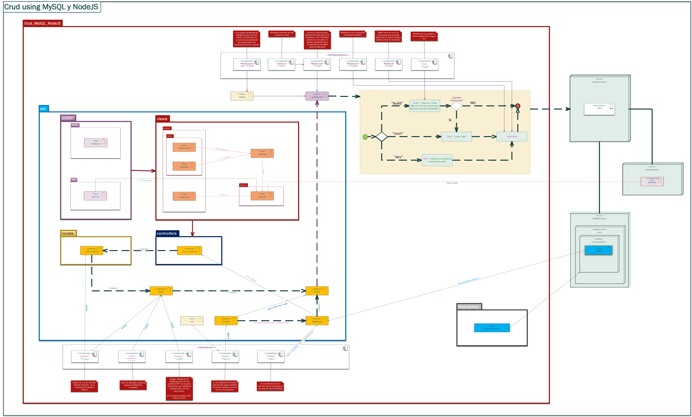
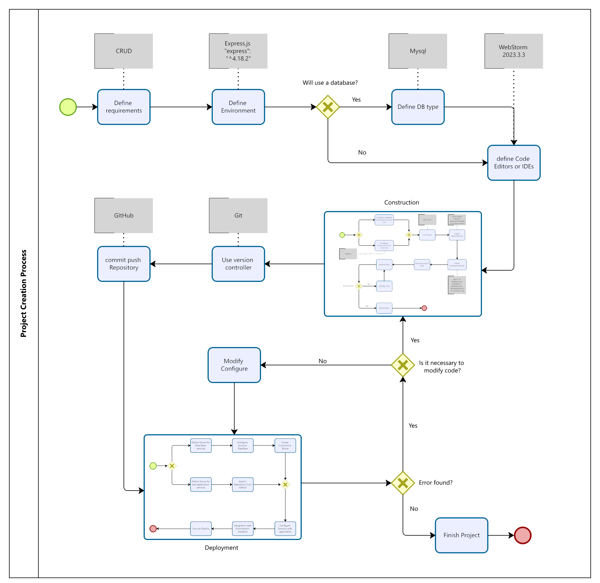
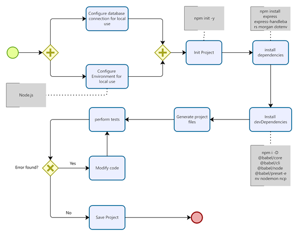
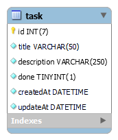

# 01_NodeJS_Mysql_CRUD


## Application Map



## Process Map
* General Map 



### Sub-Process : Construction
* Construction:
  

### Sub-Process : Deployment
* Deploy:


## Tools - Installation

#### Node.js - Installation

* <a target="_blank" href="https://nodejs.org/en/download">Installation - Page NodeJS</a>

#### MySQL Community - Installation

* <a target="_blank" href="https://dev.mysql.com/downloads/installer/">Installation - MySQL Community</a>


## Commands - Installation

* Create folder Project

#### Project Start
* Start:
  ```bash
  npm init -y
  ```

#### Dependencies
* Production
  ```bash
  npm install express express-handlebars morgan dotenv
  ```

* Mysql in Production

  ```bash
  npm i mysql2
  ```
<!---
```bash
npm i mysql express-myconnection
```
--->
<!---
* Babel in Production 
  ``` bash
  npm i @babel/runtime
  ```
--->

#### Dev Dependencies

* Babel will be used in the Dev Dependencies

  ``` bash
  npm i -D @babel/core @babel/cli @babel/node @babel/preset-env nodemon ncp
  ```
<!---
* Plugins
  ``` bash
  npm install --save-dev @babel/plugin-transform-runtime
  ```
--->

## Consideration of starting configuration

#### Physical Data Modeling

The tool `MySQL Workbench` is used to build the physical model, this tool also helps to generate the Script in SQL. 



Another option is `Enterprise Architect`, it also has similar tools
* [Script](Abstraction/03_Diagram_Physical_Model/Physical_Model.sql)
  
  ``` sql
  -- MySQL Script generated by MySQL Workbench
  -- Thu Feb  8 03:22:53 2024
  -- Model: New Model    Version: 1.0
  -- MySQL Workbench Forward Engineering
  
  SET @OLD_UNIQUE_CHECKS=@@UNIQUE_CHECKS, UNIQUE_CHECKS=0;
  SET @OLD_FOREIGN_KEY_CHECKS=@@FOREIGN_KEY_CHECKS, FOREIGN_KEY_CHECKS=0;
  SET @OLD_SQL_MODE=@@SQL_MODE, SQL_MODE='ONLY_FULL_GROUP_BY,STRICT_TRANS_TABLES,NO_ZERO_IN_DATE,NO_ZERO_DATE,ERROR_FOR_DIVISION_BY_ZERO,NO_ENGINE_SUBSTITUTION';
  
  -- -----------------------------------------------------
  -- Schema crud_mysql_test
  -- -----------------------------------------------------
  DROP SCHEMA IF EXISTS `crud_mysql_test` ;
  
  -- -----------------------------------------------------
  -- Schema crud_mysql_test
  -- -----------------------------------------------------
  CREATE SCHEMA IF NOT EXISTS `crud_mysql_test` DEFAULT CHARACTER SET utf8 ;
  USE `crud_mysql_test` ;
  
  -- -----------------------------------------------------
  -- Table `crud_mysql_test`.`task`
  -- -----------------------------------------------------
  CREATE TABLE IF NOT EXISTS `crud_mysql_test`.`task` (
  `id` INT(7) UNSIGNED ZEROFILL NOT NULL AUTO_INCREMENT,
  `title` VARCHAR(50) NOT NULL DEFAULT '',
  `description` VARCHAR(250) NOT NULL DEFAULT '',
  `done` BIT(1) NOT NULL DEFAULT 0,
  `createdAt` DATETIME NOT NULL DEFAULT CURRENT_TIMESTAMP,
  `updateAt` DATETIME NOT NULL DEFAULT CURRENT_TIMESTAMP ON UPDATE CURRENT_TIMESTAMP,
  PRIMARY KEY (`id`))
  ENGINE = InnoDB
  AUTO_INCREMENT = 1000000;
  
  
  SET SQL_MODE=@OLD_SQL_MODE;
  SET FOREIGN_KEY_CHECKS=@OLD_FOREIGN_KEY_CHECKS;
  SET UNIQUE_CHECKS=@OLD_UNIQUE_CHECKS;


  ```
<!---
* Set the start number for auto increment primary key   

  ``` sql
   ALTER TABLE `Task` AUTO_INCREMENT=1001;
  ```
--->

#### Home File
* We create the "src" folder and inside the file " index.js "

#### Run Project

* Configuration package.json

  ``` JSON
  "scripts": {
      "dev": "nodemon src/index.js --exec babel-node",
      "build": "babel src -d dist && ncp src/views dist/views && ncp src/public dist/public",
      "start": "node ./dist"
    }
  ```
* Diagram Start Project
  * dev: 
    * Development application
  * build   :
    * Production Application generation
  * start   : 
    * Production application


#### Framework CSS - Bootstrap

* Insert in '< head >' - "../src/views/layout/main.hbs"

  ``` HTML
  <link href="https://cdn.jsdelivr.net/npm/bootstrap@5.3.2/dist/css/bootstrap.min.css"
            rel="stylesheet"
            integrity="sha384-T3c6CoIi6uLrA9TneNEoa7RxnatzjcDSCmG1MXxSR1GAsXEV/Dwwykc2MPK8M2HN"
            crossorigin="anonymous">
   ```

#### Environment env

* Create and Configuration ".env"

  ```
  HOST = ******
  USER = ******
  PASSWORD = ******
  PORT_MYSQL = ******
  DATABASE = ******
  PORT = ******
  ```
#### If Error - connection DataBase

* Connection `localhost` user `root`: 

MySQL 8.0 - Client does not support authentication protocol requested by server; consider upgrading MySQL client
 
  ``` SQL
  ALTER USER 'root'@'localhost' IDENTIFIED WITH mysql_native_password BY 'password';
  ```
## Deployment

### Server : Data Base

Using MongoDB Atlas : <a target="_blank" href="https://www.mongodb.com/atlas">Subscription - Try Free</a>

#### Considerations:
* Create Cluster : Cluster() Connect to your application
  


* Copy your connection string into your application code
  
  

  ```
  <Connection_Atlas_MongoDB> 
  ```


* Network Access : From Anywhere
  ``` 
  [Access List Entry:] = <0.0.0.0/0>
  ```

### Server : Deploy

Using Render : <a target="_blank" href="https://render.com/">Subscription - Get Started for Free</a>

#### Considerations:
* Import Project from GitHub


* Environment Variable
  ``` 
  MONGODB_URI = <Connection_Atlas_MongoDB>
  ```

* Build & Deploy
  ``` JSON
  [Build Command] = 'npm run build'
  [Start Command] = 'npm start'
  ```

* Error:

  "babel: not found"

  Solution: In Setting / Build & Deploy
  ``` JSON
  [Build Command] = 'npm i -D @babel/core && babel src -d dist && ncp src/views dist/views && ncp src/public dist/public'
  [Start Command] = 'node ./dist/index.js'
  ```
